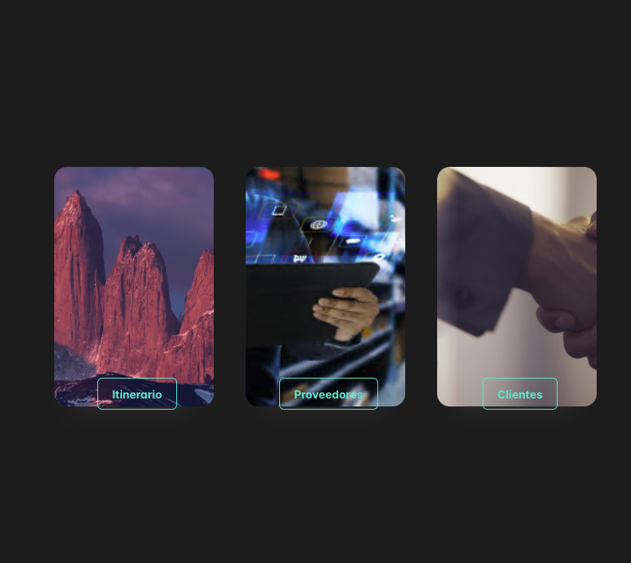

# allanproject
 gestion viajes tour clientes y hoteles

- se unifica react con django para que use interfaces desde react y no desde django templates
- se crea la primera interfaz para el ingreso a los primeros modulos de la aplicacion 

__pasos__
- creacion de cliente 
- creacion hotel 
- creacion de hotel room
- creacion de tour
- creacion de dias

borrar db
- rm db.sqlite3
